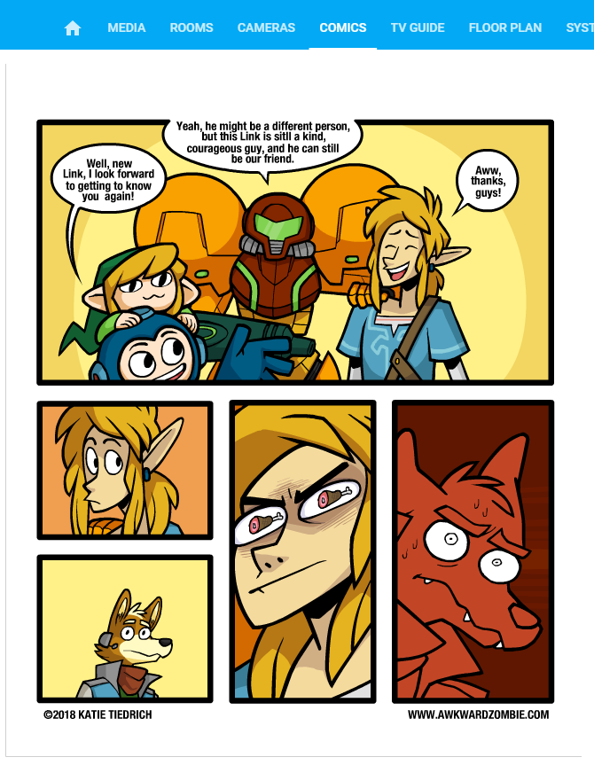

# Web-Comic-Downloader


Home Assistant sensor that pulls the URL of webcomic image, given the webcomic URL. I tested on a few webcomics (Penny Arcade, Mr. Lovenstein, Awkward Zombie) and they work.

Use with [Useful Markdown Card](https://github.com/thomasloven/lovelace-useful-markdown-card) to display the webcomic in a Lovelace card.

## Features
  - It works

## Options

| Name | Type | Default | Description
| ---- | ---- | ------- | -----------
| name | string | **Required** | Name of the webcomic, such as `Awkward Zombie`.
| url | string | **Required** | The URL of the webcomic, such as http://www.awkwardzombie.com/

## Instructions
1. Download the Webcomic Sensor.
4. Place the file in your `config/custom_components/sensor` folder.
5. Include the sensor in your `configuration.yaml`
```yaml
- platform: webcomic
  name: "Awkward Zombie"
  url: "http://www.awkwardzombie.com/"
```

6. Restart Home Assistant to load the sensor.
7. Check Home Assistant >> Developer Tools >> States to see if the sensor loaded correctly.
8. If the sensor state is 'URL found', then the webcomic URL was identified (hopefully).
8. Download [Useful Markdown Card](https://github.com/thomasloven/lovelace-useful-markdown-card) and install per instructions.
9. Add a useful-markdown-card in Lovelace and load the webcomic using the example below. 
```yaml
- type: custom:useful-markdown-card
  content: >
    
```

## Support
I am studying Python as a hobby and this is my first public project. Some fixes/requests may be out of my scope but I'll try my best. I hope you find it useful!

## Credits
  - [Useful Markdown Card](https://github.com/thomasloven/lovelace-useful-markdown-card) - To display the comic in a Lovelace card. 
